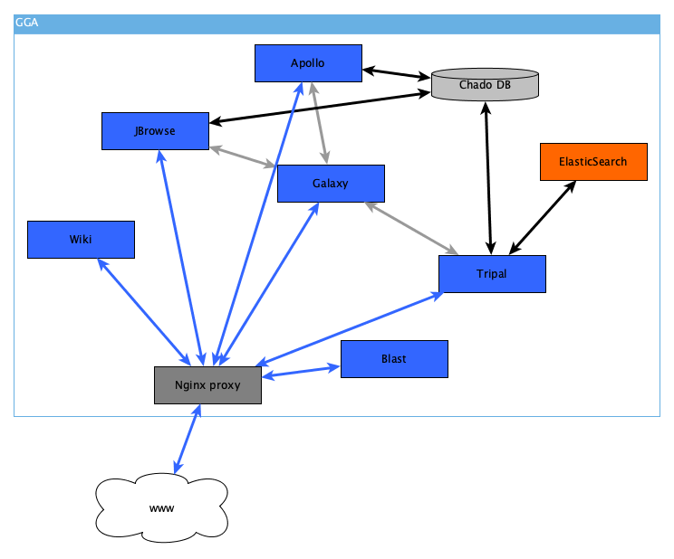

# GGA - Galaxy Genome Annotation

Homepage: https://galaxy-genome-annotation.github.io/

GMOD suite, a collection of open-source applications and databases for visualizing, annotating, and managing genetic and genomic data (JBrowse, Apollo, Tripal, Chado, etc.).

The Galaxy Genome Annotation project is an open-source licensed initiative from the Galaxy and the GMOD communities. This e-infrastructure uses lightweight virtualization technologies with Docker containers and is based on the GMOD suite and the Galaxy web portal: GMOD tools are dockerized and Galaxy is used as a data loading orchestrator for administrators, with dedicated Galaxy tools and Python libraries to make all tools work together.

**Schematic representation of a set of Docker containers deployed with GGA for annotation / visualization, for a typical genome.** Blue arrows represent HTTP traffic. Gray arrows represent data exchange performed using Galaxy tools. Black arrows represent data exchange inherent in applications.